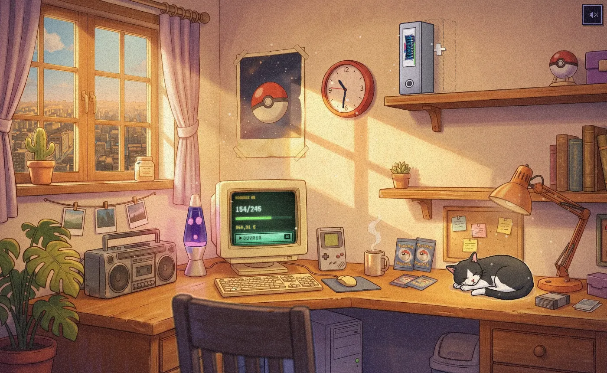
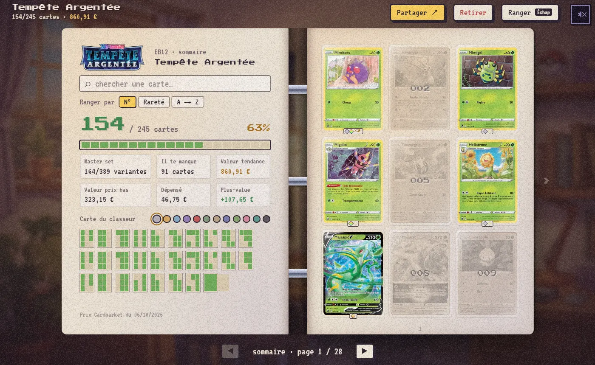
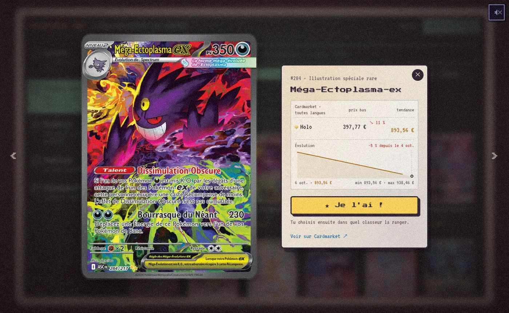
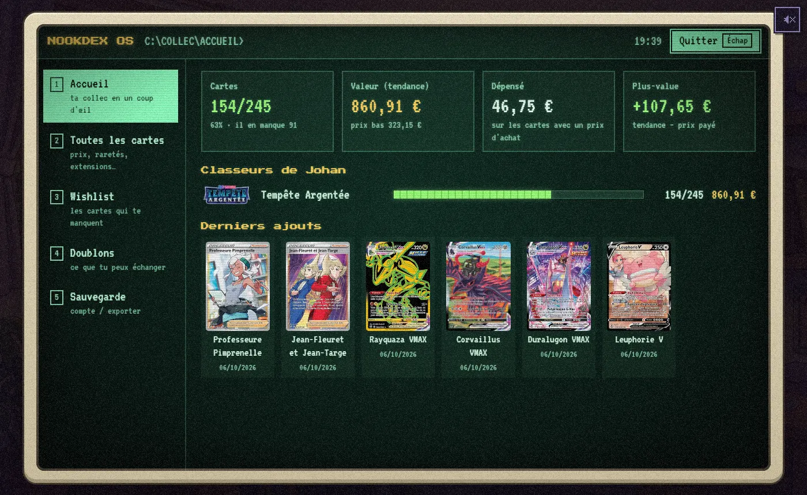
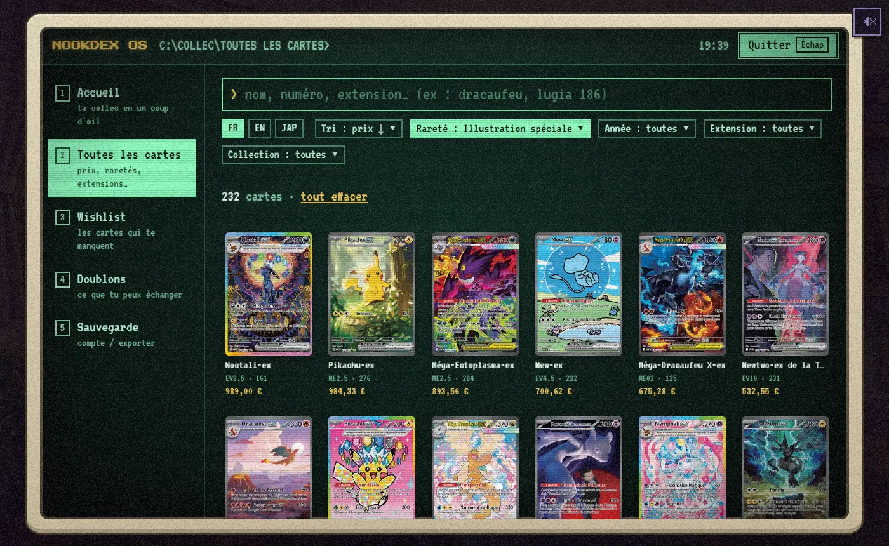

# NookDex

**A Pokémon TCG collection tracker drawn as a cosy painted desk.**
Your sets are binders on a shelf, the old computer on the desk runs your stats, and the cat sleeps next to your boosters.

**→ [nookdex.com](https://nookdex.com)** · free, in French and English, on desktop and phone



## What it does

- **One binder per set.** Pick a set (French, English or Japanese cards), it goes on the shelf. Open it, turn the pages:
  grey cards are the ones you're missing, a tap marks a card as owned.
- **Every copy, in detail.** Variant (normal, reverse, holo), Cardmarket condition, duplicates, price paid or "pulled
  from a booster". The card sheet shows today's market price, the 7-day trend and a price curve.
- **Free binders** for whatever you like: favourites, a deck, cards to trade. You can search all ~43,000 cards to fill them.
- **NookDex OS**, the desk computer: collection value, spending and gains, **all cards** (search, filter by rarity,
  year and set, sort by price), wishlist, duplicates to trade, save and account.
- **Prices in the card's own market.** French and Japanese cards are priced on Cardmarket (€), English cards on
  TCGplayer ($). Totals are added up in your currency. Prices are refreshed every day.
- **Your collection follows you.** You can sign in with an e-mail link or Google to sync across devices, or play
  without an account and export a file.
- **Share your progress**: a picture of a binder (completion, value, best cards) ready for social media.
- **Made to feel like a little game**: hand-painted scene, low-fps "boil" animation, film grain, sounds synthesized in
  the browser, a lofi radio, and a guided tour on your first visit.

The site also has a blog (price analyses, upcoming sets), one page per set with its most valuable cards, and a release
calendar.

| | |
| --- | --- |
|  |  |
|  |  |

## How it's built

| | |
| --- | --- |
| App | [Next.js](https://nextjs.org) (App Router), React, [zustand](https://zustand.docs.pmnd.rs) (state, saved in the browser), [motion](https://motion.dev) |
| Accounts and sync | [Supabase](https://supabase.com) (magic link and Google sign-in, one JSON save per player, asks which one to keep when two devices disagree) |
| Card data | [TCGdex](https://tcgdex.dev): cards, scans and Cardmarket prices. English prices from TCGplayer, with [TCGCSV](https://tcgcsv.com) for the cards TCGdex doesn't link. |
| Data pipeline | Scripts turn the card data into static JSON (`public/sets/`). A daily GitHub Action refreshes prices and appends to a price history. |
| Hosting | [Vercel](https://vercel.com), with e-mails sent through [Brevo](https://brevo.com) |
| Visuals | A painted scene, cut into layers (binders, cat, lamp…) by `scripts/build-scene.mjs` |

There's no card database server: every set is a static file the browser downloads when it needs it. The room is
client-only. The notebook pages (about, blog, set pages, release calendar) are server-rendered for search engines.

## Run it locally

```bash
npm install
npm run dev
```

Dev-only URL shortcuts: `?skip` (skip the loader), `?open=<setId>` (open a binder), `?os` (open the computer),
`?demo` (fill a test collection).

### Card data

```bash
npm run fetch-set                     # sets not downloaded yet
npm run fetch-set -- --force          # refresh every binder set's prices
npm run fetch-set -- sv08             # one set (and its sub-sets)
npm run fetch-set -- --lang=en        # the same in English (TCGplayer prices); --lang=ja for Japanese
npm run build-scene                   # cut the painted scene into layers (public/scene, src/data/scene.json)
```

## Where things are

| Path | What |
| --- | --- |
| `src/components/room/` | The painted desk, its layers and animations |
| `src/components/binder/` | A binder: cover, pages, card slots, the card sheet |
| `src/components/computer/` | NookDex OS |
| `src/components/shelf/` | First visit (welcome, guided tour), new-binder menu |
| `src/app/(desk)/` | The room, plus the notebook pages opened over it (about, blog, sets, release calendar) |
| `src/lib/` | Store, cloud sync, catalog, prices, search, sounds |
| `scripts/` | Card data, price history, scene and icon builders |
| `content/blog/` | Blog posts (Markdown, French and English) |
| `docs/` | Supabase schema, e-mail templates, blog guidelines, plans |

## Credits

Card data, scans and Cardmarket prices: [TCGdex](https://tcgdex.dev). English prices: TCGplayer, via TCGdex and
[TCGCSV](https://tcgcsv.com).

NookDex is a fan project. It isn't affiliated with, endorsed or sponsored by Nintendo, The Pokémon Company, Creatures,
GAME FREAK, Cardmarket or TCGplayer. Pokémon and the card images are trademarks and © of their respective owners.

Made by Johan. If you like it, [you can buy the cat a treat](https://paypal.me/JohanTrigeard) 🐈
